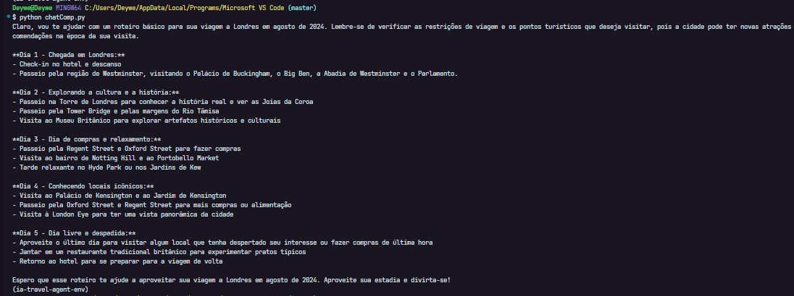
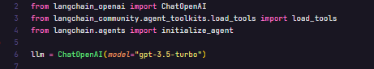
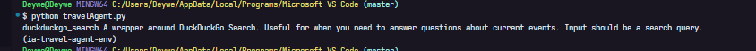
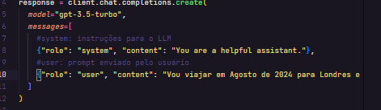
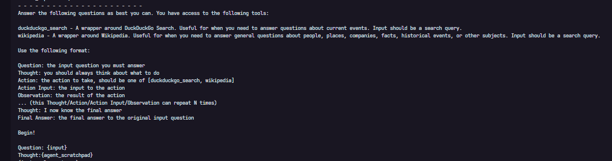

# IA TRAVEL AGENT

## LLM

O LLM utilizado foi o da OpenAI, portanto foi necessário criar uma conta na plataforma deles para ter acesso as chaves de API que vamos utilizar;

## MOTIVAÇÃO

O objetivo de criar nosso próprio agente de IA é para que o mesmo tenha acesso a recursos extras, recursos estes que não estão disponíveis no Chat GPT por padrão.
Um bom exemplo está relacionado com o prompt que estamos utilizando para efeito de teste. O prompt `Vou viajar em Agosto de 2024 para Londres e quero um roteiro de viagens`, quando enviado no frontend do Chat GPT retorna um roteiro de eventos com informações genéricas, não levando em consideração, por exemplo, os eventos que vão ocorrer em Londres nesta data.
Com a nossa própria IA, utilizando o LLM da OpenAI, poderemos fazer a busca pelos valores de passagens atualizados além de conseguir criar um roteiro que leva em consideração os eventos que estão para ocorrer no futuro.

## OBJETIVO

Gerar Texto a partir do Input do Usuário
https://platform.openai.com/docs/guides/text-generation

## MODELO UTILIZADO

Estamos utilizando o modelo `gpt-3.5-turbo-16k` ao invés de utilizar o modelo `gpt-4o` por conta da tabela de preços. O modelo 3.5 é, em média, 10x mais barato do que o modelo mais atual disponível da OpenAI.

## SET UP VIRTUAL ENVIRONMENT

https://platform.openai.com/docs/quickstart?context=python

Once you have Python installed, it is a good practice to create a virtual python environment to install the OpenAI Python library. Virtual environments provide a clean working space for your Python packages to be installed so that you do not have conflicts with other libraries you install for other projects. You are not required to use a virtual environment, so skip to step 3 if you do not want to set one up.

To create a virtual environment, Python supplies a built in `venv module` which provides the basic functionality needed for the virtual environment. Running the command below will create a virtual environment named `"openai-env"` inside the current folder you have selected in your terminal / command line:

`python -m venv openai-env`

Once you’ve created the virtual environment, you need to activate it. On
Windows, run:

`openai-env/Scripts/activate`

On Unix or MacOS, run:

`source openai-env/bin/activate`

You should see the terminal / command line interface change slightly after you active the virtual environment, it should now show `"openai-env"` to the left of the cursor input section. For more details on working wit virtual environments, please refer to the official Python documentation.

## INSTALL OPEN AI DEPENDENCY

Once you have Python 3.7.1 or newer installed and (optionally) set up a virtual environment, the OpenAI Python library can be installed. From the terminal / command line, run:

`pip install --upgrade openai`

Once this completes, running `pip list` will show you the Python libraries you have installed in your current environment, which should confirm that the OpenAI Python library was successfully installed.

## SET UP API KEY FOR A SINGLE PROJECT

If you only want your API key to be accessible to a single project, you can create a local .env file which contains the API key and then explicitly use that API key with the Python code shown in the steps to come.

Start by going to the project folder you want to create the .env file in.

In order for your `.env` file to be ignored by version control, create a `.gitignore` file in the root of your project directory. Add a line with `.env` on it which will make sure your API key or other secrets are not accidentally shared via version control.
Once you create the `.gitignore` and `.env` files using the terminal or an integrated development environment (IDE), copy your secret API key and set it as the `OPENAI_API_KEY` in your `.env` file. If you haven't created a secret key yet, you can do so on the API key page.

The `.env` file should look like the following:

```jsx
  # Once you add your API key below, make sure to not share it with anyone! The API key should remain private.

  OPENAI_API_KEY=abc123
```

The API key can be imported by running the code below:

```jsx
  from openai import OpenAI

  client = OpenAI()
  # defaults to getting the key using os.environ.get("OPENAI_API_KEY")
  # if you saved the key under a different environment variable name, you can do something like:
  # client = OpenAI(
  #   api_key=os.environ.get("CUSTOM_ENV_NAME"),
  # )
```

## INSTALANDO DEPENDÊNCIAS

- Adicionar

`pip install {dependency-name}`

- Remover

`pip install {dependency-name}`

## EXECUTANDO ARQUIVOS

`python {filename}.py`

> # AULA 1

## AULA 01.1

Foi adicionada a configuração inicial e testamos o output para entendimento de como podemos fazer uso do LLM;

## AULA 01.2

Alteramos a mensagem enviada pelo usuário para verificar que a resposta que obtivemos da IA é similar a resposta que obtivemos utilizando o frontend do ChatGPT.



## AULA 01.3

### AGENTES DE IA

Para contextualizar o LLM, utilizamos os `Agentes de IA`. Os agentes de IA são estruturas mais complexas que fornecem um conjunto de ferramentas junto ao LLM, permitindo adicionar contexto e permitir uma melhor interação. Essa interação melhorada se da pelo fato de que com os agentes conseguimos passar informações novas, que complementam o contexto. Entre elas, podemos passar, por exemplo, o hotel no qual vamos nos hospedar e pedir referências de locais para um jantar que estejam localizados próxima a nossa estadia.

#### AGENTES DE IA - FERRAMENTAS

Utilizamos o `LangChain` para adicionar agentes que nos permitem fazer buscas na internet, consultar bancos de dados, etc.
https://www.langchain.com/

A inicialização do `llm` não será mais feita utilizando a lib da OpenAI, mas sim a lib do LangChain.



As ferramentas (`tools`) contém as informações que vamos passar para o nosso `llm` no formato de instruções. Na imagem abaixo podemos notar no print que é exibido o nome da ferramenta e a descrição. Essa descrição auxilia a o modelo a saber quando essa ferramenta pode ser útil.


Ao inicializar o `agent` podemos visualizar no terminal que o resultado é um prompt. Esse prompt é um conjunto de informações (instruções) que será aplicado a nossa IA para que ela entenda o passo a passo do que deve ser feito antes de responder ao input do usuário.

- Instruções passadas de forma padrão
  

- Instruções passadas através do `agent`
  

Adicionamos a propriedade `verbose` no `agent` para conseguir visualizar a cadeia de pensamentos da IA ocorrendo em tempo real:


| Fim da AULA 01

#######################################################################################################

> # AULA 02

## AULA 02.1

### ReAct - Re => Reason / Act => Act

https://react-lm.github.io/

O `prompt` que importamos pronto é no formato `ReAct`. O `Langchain` é no formato `Reason Only` enquanto os ChatGPT é no formato `Act Only`.


### Correção do Warning

Começamos a aula 2 fazendo a correção do alerta que é exibido no terminal sobre o fim do suporte da função `initialize_agent`.

```jsx
The function `initialize_agent` was deprecated in LangChain 0.1.0 and will be removed in 0.3.0. Use Use new agent constructor methods like create_react_agent, create_json_agent, create_structured_chat_agent, etc. instead.
```

## AULA 02.2

### Refactor função de busca

Movemos tudo que diz respeito ao envio do input do usuário para o LLM para a função `researchAgent`
